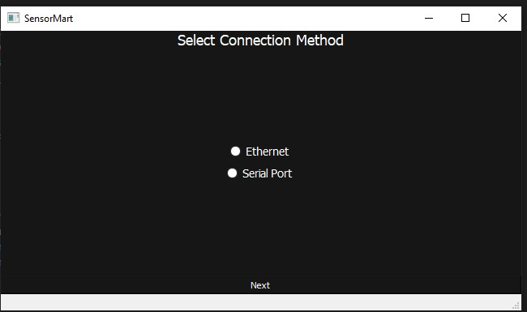
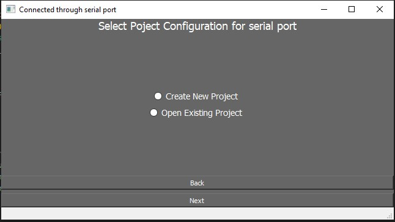
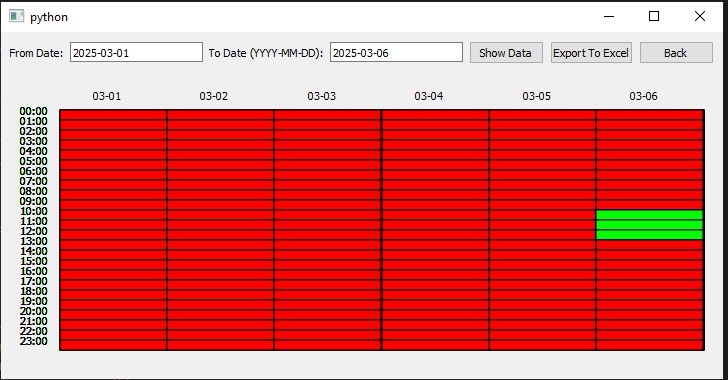
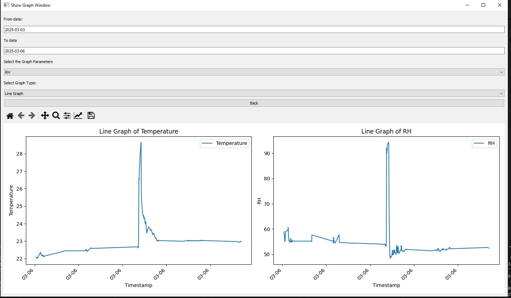

# Main Screen page

# Select port window

# Select project window

# Select show_data window

# Select show_graph window

datalogger/
│
├── configuration/      # Configuration files and settings
│
├── gui/                # GUI components and related files
│
├── myenv/              # Virtual environment for the project
│
├── main.py             # Main entry point of the application
│
├── README.md           # Project documentation
│
└── requirments.txt    # Python dependencies
